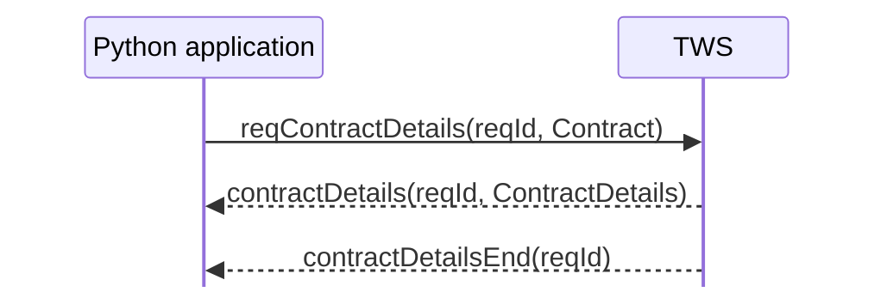

# The `Contract` object

A stock symbol is not enough to describe a tradable instrument in the TWS API.

IBKR uses a `Contract` object to describe **what instrument an API operation refers to**.

For a U.S. stock, the familiar starting point is:

```python
from ibapi.contract import Contract

contract = Contract()
contract.symbol = "NVDA"
contract.secType = "STK"
contract.exchange = "SMART"
contract.currency = "USD"
```

This object does not contain market data, an order, or a position. It is an instrument description that can be passed to API requests and commands that need to know what should be looked up, priced, or traded.

A `Contract` can be only partially specified or detailed enough to identify one specific instrument.

## Core stock fields

For the stock workflows in this guide, the most important `Contract` fields are:

| Field | Meaning |
| --- | --- |
| `symbol` | The instrument symbol, for example `NVDA` |
| `secType` | Security type; `STK` means stock or ETF |
| `exchange` | The exchange or routing destination used by the API |
| `currency` | The contract currency, for example `USD` |
| `primaryExchange` | The instrument's primary listing exchange when needed for disambiguation |
| `conId` | IBKR's numeric contract identifier |

We will treat `primaryExchange` and `conId` separately later. For now, the key point is that IBKR identifies an instrument using **several properties**, not just its ticker symbol.

## Why the symbol alone is insufficient

Consider:

```python
contract = Contract()
contract.symbol = "ABC"
```

That does not state whether the instrument is a stock, which currency is intended, which market is relevant, or whether another instrument shares the same or a similar symbol.

Adding fields narrows the description:

```text
symbol only
    ↓
add security type
    ↓
add exchange/routing information
    ↓
add currency
    ↓
more specific contract description
```

The exact fields required depend on the API operation and whether the description is already unambiguous.

## Partial contracts are useful

A partially specified `Contract` is not necessarily wrong.

One important use is **contract resolution**. You can deliberately send a description to:

```python
self.reqContractDetails(reqId, contract)
```

and ask IBKR which contracts in its database match it.



A broad description may match several contracts. A sufficiently specific description may match exactly one.

We will implement this lookup properly in the contract-resolution chapter.

## `Contract` versus `ContractDetails`

These two names are easy to confuse:

```text
Contract
= description of the instrument

ContractDetails
= IBKR metadata returned about a matched contract
```

The flow is:

```text
your Contract description
        ↓
reqContractDetails(...)
        ↓
IBKR searches its contract database
        ↓
ContractDetails result
```

`ContractDetails` contains substantially more information than you normally provide when constructing a stock `Contract`, including the resolved contract and metadata such as valid exchanges, market rules, and trading hours.

That richer object belongs to the later resolution chapter.

## Your application commonly creates the `Contract`

Unlike many objects received through `EWrapper`, a `Contract` is commonly created by your own application and passed into an `EClient` method:

```text
application
   ↓ creates
Contract
   ↓ passes to
EClient request or command
   ↓
TWS / IBKR
```

IBKR may also return `Contract` objects inside response objects, but the important starting case is that **your application describes the instrument it wants to operate on**.

## Constructing is not resolving

Creating:

```python
contract.symbol = "NVDA"
contract.secType = "STK"
contract.exchange = "SMART"
contract.currency = "USD"
```

does not query IBKR or prove that the description resolves to the instrument you expect. It is just a Python object until you pass it to an API operation.

```text
construct Contract
≠
resolve Contract against IBKR's database
```

The next chapters make that process explicit.

## The mental model to keep

```text
Contract
├── describes what instrument you mean
├── is commonly constructed by your application
├── contains fields such as symbol, security type, exchange, and currency
├── may be partial or uniquely identifying
└── is passed into API operations that need an instrument
```

For this guide, the progression is:

```text
Contract object
      ↓
define a U.S. stock
      ↓
resolve it with reqContractDetails()
      ↓
understand SMART, primaryExchange, and conId
```

The next chapter turns this generic object into the standard contract definitions we will use for U.S. stocks throughout the rest of the course.

## Official references

- [Defining contracts in the TWS API](https://ibkrcampus.com/campus/trading-lessons/defining-contracts-in-the-tws-api/)
- [Contract details](https://www.interactivebrokers.com/docs/tws-api/doc/contracts-financial-instruments/contract-details/introduction)
- [TWS API Reference](https://www.interactivebrokers.com/docs/tws-api/ref/introduction)
