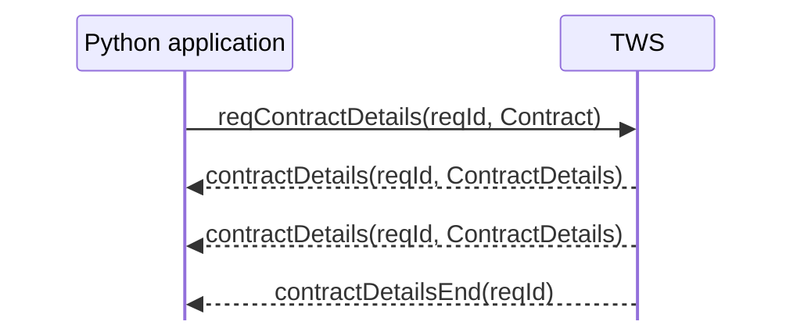

# Contract resolution and `ContractDetails`

A `Contract` describes the instrument your application means. Contract resolution asks IBKR to compare that description against its contract database and return the matching instrument information.

The interaction is:



There may be zero, one, or several `contractDetails(...)` callbacks before the end marker.

## From description to resolved contract

Suppose the application creates:

```python
contract = Contract()
contract.symbol = "NVDA"
contract.secType = "STK"
contract.exchange = "SMART"
contract.currency = "USD"
```

Calling:

```python
self.reqContractDetails(1, contract)
```

asks IBKR which contracts in its database match that description.

Each match arrives as a `ContractDetails` object. Its most important attribute for now is:

```python
contractDetails.contract
```

which contains the matched `Contract` returned by IBKR. It can include identifying fields that were not supplied in the request, such as:

```text
conId
primaryExchange
localSymbol
tradingClass
```

The surrounding `ContractDetails` object adds metadata such as `longName`, `validExchanges`, `minTick`, trading hours, and `timeZoneId`.

So the distinction is:

```text
Contract
= description sent to IBKR

ContractDetails
= metadata returned for one matching contract
```

## Runnable example

The example for this chapter is:

```text
examples/02_contracts/resolve_contract.py
```

It deliberately leaves out `primaryExchange` so that you can see what IBKR resolves and returns.

```python
from ibapi.client import EClient
from ibapi.contract import Contract, ContractDetails
from ibapi.wrapper import EWrapper


REQUEST_ID = 1


def create_stock_contract() -> Contract:
    """Create the stock description that will be resolved by IBKR."""
    contract = Contract()
    contract.symbol = "NVDA"
    contract.secType = "STK"
    contract.exchange = "SMART"
    contract.currency = "USD"
    return contract


class ContractResolutionApp(EWrapper, EClient):
    """Resolve a stock description and print the matching IBKR contracts."""

    def __init__(self) -> None:
        EClient.__init__(self, wrapper=self)
        self.match_count = 0

    def nextValidId(self, orderId: int) -> None:
        """Request contract details once the API connection is ready."""
        print(f"Connected. Next valid order ID: {orderId}")
        self.reqContractDetails(REQUEST_ID, create_stock_contract())

    def contractDetails(self, reqId: int, contractDetails: ContractDetails) -> None:
        """Print one contract that matched the request."""
        self.match_count += 1
        contract = contractDetails.contract

        print(f"\nMatch {self.match_count} for request {reqId}")
        print(f"  symbol: {contract.symbol}")
        print(f"  conId: {contract.conId}")
        print(f"  secType: {contract.secType}")
        print(f"  exchange: {contract.exchange}")
        print(f"  primaryExchange: {contract.primaryExchange}")
        print(f"  currency: {contract.currency}")
        print(f"  localSymbol: {contract.localSymbol}")
        print(f"  tradingClass: {contract.tradingClass}")
        print(f"  longName: {contractDetails.longName}")
        print(f"  validExchanges: {contractDetails.validExchanges}")

    def contractDetailsEnd(self, reqId: int) -> None:
        """End the example after all matches for the request have arrived."""
        print(f"\nRequest {reqId} complete. Matches: {self.match_count}")
        self.disconnect()


def main() -> None:
    app = ContractResolutionApp()
    app.connect(host="127.0.0.1", port=7497, clientId=1)
    app.run()


if __name__ == "__main__":
    main()
```

The application structure is intentionally the same as `current_time.py`. The new pieces are the `Contract`, request ID, and contract-detail callbacks.

## What happens when it runs

`nextValidId()` again acts as the connection-readiness signal. From there:

```text
reqContractDetails(reqId=1, contract)
        ↓
contractDetails(reqId=1, match)
        ↓ possibly repeated
contractDetailsEnd(reqId=1)
        ↓
disconnect
```

The request ID belongs to this request. It is not a `clientId`, `orderId`, or `conId`.

The important detail is that the application does **not** disconnect after the first match. `contractDetailsEnd(...)` is the signal that no more results remain for that request.

## Run it

Start TWS in paper trading with API socket clients enabled, then run:

```powershell
uv run python examples/02_contracts/resolve_contract.py
```

A successful run should contain output shaped roughly like:

```text
Connected. Next valid order ID: ...

Match 1 for request 1
  symbol: NVDA
  conId: ...
  secType: STK
  exchange: SMART
  primaryExchange: NASDAQ
  currency: USD
  localSymbol: NVDA
  tradingClass: NMS
  longName: NVIDIA CORP
  validExchanges: ...

Request 1 complete. Matches: 1
```

Informational messages such as 2104 and 2106 may appear between these lines, just as they did in the first connection example.

## Zero, one, or several matches

A broad `Contract` description can match several instruments. Each match produces its own `contractDetails(...)` callback with the same `reqId`.

A more specific description may produce one match. If no `contractDetails(...)` callback arrives before `contractDetailsEnd(...)`, no matching contract details were returned.

This makes contract resolution a useful way to investigate instrument identity before relying on a contract in later market-data or order workflows.

## Things to inspect yourself

After the example works, change one thing at a time:

- replace `NVDA` with `AAPL`, `MSFT`, or `AMD`;
- add `primaryExchange = "NASDAQ"` and compare the result;
- remove `currency = "USD"` or `exchange = "SMART"` and inspect the matches;
- print `contractDetails.minTick` or `contractDetails.timeZoneId`;
- temporarily print `vars(contractDetails)` to see the full returned object.

For now, keep the resolution process visible rather than hiding it behind a general contract-discovery helper.

## The mental model to keep

```text
Contract
→ what your application asks IBKR to resolve

contractDetails(...)
→ one matching ContractDetails object

contractDetailsEnd(...)
→ no more matches for that request
```

The next chapter focuses on three fields that are now visible in context: `exchange="SMART"`, `primaryExchange`, and `conId`.

## Official references

- [Contract details](https://www.interactivebrokers.com/docs/tws-api/doc/contracts-financial-instruments/contract-details/introduction)
- [ContractDetails reference](https://www.interactivebrokers.com/docs/tws-api/ref/contract-details)
- [Defining contracts in the TWS API](https://www.interactivebrokers.com/campus/trading-lessons/defining-contracts-in-the-tws-api/)
