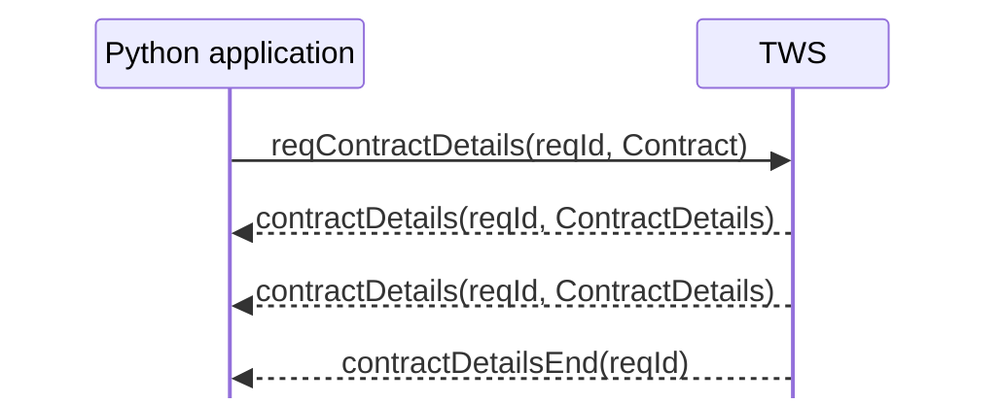

# Contract resolution and `ContractDetails`

A `Contract` describes the instrument your application means. Contract resolution asks IBKR to compare that description against its contract database and return the matching instrument information.

The request is:

```python
self.reqContractDetails(reqId, contract)
```

and the response follows the finite callback pattern introduced earlier:



There may be zero, one, or several `contractDetails(...)` callbacks before the end marker.

## What contract resolution does

Suppose the application creates:

```python
contract = Contract()
contract.symbol = "NVDA"
contract.secType = "STK"
contract.exchange = "SMART"
contract.currency = "USD"
```

This is a useful description, but it is still only a local Python object.

Calling:

```python
self.reqContractDetails(1, contract)
```

asks IBKR:

> Which contract or contracts in your database match this description?

IBKR then returns a `ContractDetails` object for each match.

Conceptually:

```text
local Contract description
        ↓
reqContractDetails(...)
        ↓
IBKR contract database
        ↓
zero / one / many matches
        ↓
ContractDetails callbacks
        ↓
contractDetailsEnd(...)
```

## `ContractDetails` contains a resolved `Contract`

The callback receives a `ContractDetails` object:

```python
def contractDetails(self, reqId: int, contractDetails: ContractDetails) -> None:
    ...
```

One of its most important attributes is:

```python
contractDetails.contract
```

which is the matched `Contract` returned by IBKR.

That resolved contract can contain identifying fields that were not present in the original request, including:

```text
conId
primaryExchange
localSymbol
tradingClass
```

`ContractDetails` itself also contains metadata such as:

```text
longName
validExchanges
minTick
orderTypes
tradingHours
liquidHours
timeZoneId
```

We do not need every field yet. The useful lesson is that resolution turns a compact instrument description into broker-supplied instrument metadata.

## The runnable example

The example for this chapter is:

```text
examples/02_contracts/resolve_contract.py
```

It deliberately requests NVDA without specifying `primaryExchange` so that the returned contract shows what IBKR resolved.

```python
from ibapi.client import EClient
from ibapi.contract import Contract, ContractDetails
from ibapi.wrapper import EWrapper


REQUEST_ID = 1


def create_stock_contract() -> Contract:
    """Create the stock description that will be resolved by IBKR."""
    contract = Contract()
    contract.symbol = "NVDA"
    contract.secType = "STK"
    contract.exchange = "SMART"
    contract.currency = "USD"
    return contract


class ContractResolutionApp(EWrapper, EClient):
    """Resolve a stock description and print the matching IBKR contracts."""

    def __init__(self) -> None:
        EClient.__init__(self, wrapper=self)
        self.match_count = 0

    def nextValidId(self, orderId: int) -> None:
        """Request contract details once the API connection is ready."""
        print(f"Connected. Next valid order ID: {orderId}")
        self.reqContractDetails(REQUEST_ID, create_stock_contract())

    def contractDetails(self, reqId: int, contractDetails: ContractDetails) -> None:
        """Print one contract that matched the request."""
        self.match_count += 1
        contract = contractDetails.contract

        print(f"\nMatch {self.match_count} for request {reqId}")
        print(f"  symbol: {contract.symbol}")
        print(f"  conId: {contract.conId}")
        print(f"  secType: {contract.secType}")
        print(f"  exchange: {contract.exchange}")
        print(f"  primaryExchange: {contract.primaryExchange}")
        print(f"  currency: {contract.currency}")
        print(f"  localSymbol: {contract.localSymbol}")
        print(f"  tradingClass: {contract.tradingClass}")
        print(f"  longName: {contractDetails.longName}")
        print(f"  validExchanges: {contractDetails.validExchanges}")

    def contractDetailsEnd(self, reqId: int) -> None:
        """End the example after all matches for the request have arrived."""
        print(f"\nRequest {reqId} complete. Matches: {self.match_count}")
        self.disconnect()


def main() -> None:
    app = ContractResolutionApp()
    app.connect(host="127.0.0.1", port=7497, clientId=1)
    app.run()


if __name__ == "__main__":
    main()
```

The application structure is intentionally the same as the first connection example. The new concepts are the `Contract`, the request ID, and the pair of contract-detail callbacks.

## Trace the example

### 1. Wait for API readiness

The request starts from:

```python
def nextValidId(self, orderId: int) -> None:
```

As before, this callback is used as the signal that the connection is ready for API requests.

### 2. Send one contract-details request

```python
self.reqContractDetails(REQUEST_ID, create_stock_contract())
```

The integer `REQUEST_ID` belongs to this request. It is not a `clientId`, `orderId`, or `conId`.

The same request ID comes back in the corresponding callbacks.

### 3. Receive each match

For every matching contract, TWS invokes:

```python
def contractDetails(self, reqId: int, contractDetails: ContractDetails) -> None:
```

The example prints both fields from the resolved `Contract` and metadata from the surrounding `ContractDetails` object.

This is a good place to see the distinction directly:

```text
contractDetails.contract.conId
contractDetails.contract.primaryExchange
contractDetails.longName
contractDetails.validExchanges
```

### 4. Wait for the end marker

The application must not assume that the first callback is the final callback.

Completion is signalled separately:

```python
def contractDetailsEnd(self, reqId: int) -> None:
```

Only then does the example print the match count and disconnect.

This is exactly the request → many callbacks → end-marker pattern from the callback-patterns chapter.

## Run it

Start TWS in paper trading with API socket clients enabled, then run from the repository root:

```powershell
uv run python examples/02_contracts/resolve_contract.py
```

A successful run should contain output shaped roughly like:

```text
Connected. Next valid order ID: ...

Match 1 for request 1
  symbol: NVDA
  conId: ...
  secType: STK
  exchange: SMART
  primaryExchange: NASDAQ
  currency: USD
  localSymbol: NVDA
  tradingClass: NMS
  longName: NVIDIA CORP
  validExchanges: ...

Request 1 complete. Matches: 1
```

You may also see informational messages such as 2104 and 2106 interleaved with this output. Those are handled through the same error/status channel discussed in the fundamentals section.

## Zero, one, or several matches

`reqContractDetails()` is unusual because the supplied `Contract` does not have to identify exactly one instrument.

A broad description can produce several callbacks:

```text
request 7
  ↓
contractDetails(reqId=7, match A)
contractDetails(reqId=7, match B)
contractDetails(reqId=7, match C)
contractDetailsEnd(reqId=7)
```

A sufficiently specific description may produce one.

If no `contractDetails(...)` callback arrives before `contractDetailsEnd(...)`, the request produced no matching contract details.

The request ID lets the application distinguish this result stream from other requests that may be active at the same time.

## What to inspect yourself

After the example works, change one field at a time:

- change `NVDA` to `AAPL`, `MSFT`, or `AMD`;
- add `primaryExchange = "NASDAQ"` and compare the result;
- remove `currency = "USD"` and observe whether the result set changes;
- remove `exchange = "SMART"` and inspect what IBKR returns;
- print `contractDetails.minTick` or `contractDetails.timeZoneId`;
- temporarily print `vars(contractDetails)` to see how much metadata the object contains.

The goal is to understand how the specificity of the request affects what IBKR resolves, not to build a general-purpose contract-discovery abstraction yet.

## The mental model to keep

```text
Contract
= what your application asks IBKR to resolve

ContractDetails
= metadata IBKR returns for one matching contract

contractDetails(...)
= one match

contractDetailsEnd(...)
= no more matches for that request
```

The next chapter will focus on three fields that are now visible in context: `exchange="SMART"`, `primaryExchange`, and `conId`.

## Official references

- [Contract details](https://www.interactivebrokers.com/docs/tws-api/doc/contracts-financial-instruments/contract-details/introduction)
- [ContractDetails reference](https://www.interactivebrokers.com/docs/tws-api/ref/contract-details)
- [Defining contracts in the TWS API](https://www.interactivebrokers.com/campus/trading-lessons/defining-contracts-in-the-tws-api/)
