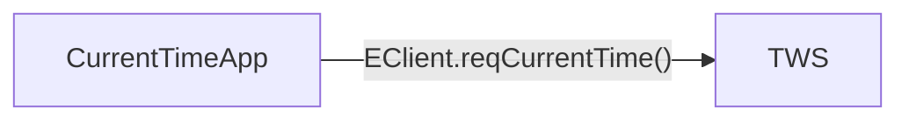
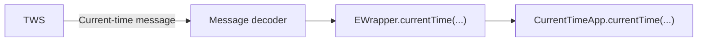

# First connection: request the server time

The first runnable example should prove the architecture with as little unrelated API surface as possible.

We therefore request the current IBKR server time. This gives us:

- a real connection to TWS;
- an outbound `EClient` request;
- an inbound `EWrapper` callback;
- the API processing loop;
- a clean termination point;
- no contracts, market-data permissions, or orders yet.

The runnable file is:

```text
examples/01_connection/current_time.py
```

## Prepare the environment

This repository uses `uv` for its environment and dependencies.

From the repository root:

```powershell
uv sync
```

The official TWS API Python client is distributed with the TWS API download rather than through a supported IBKR package on PyPI. Install the local `pythonclient` source into this repository's uv environment. With the default Windows API installation, for example:

```powershell
uv pip install "C:\TWS API\source\pythonclient"
```

If you installed the TWS API elsewhere, replace the path accordingly.

Confirm that the environment can import the API:

```powershell
uv run python -c "import ibapi; print(ibapi.__file__)"
```

## Before running the example

Start TWS and log in to your paper-trading session. In the TWS API settings:

1. enable socket clients;
2. confirm the configured socket port;
3. keep the example on the paper-trading port unless you intentionally changed it.

The example uses:

```python
host = "127.0.0.1"
port = 7497
clientId = 1
```

`7497` is commonly used by TWS paper trading, but the value that matters is the port configured in your own TWS session.

## The complete example

```python
from datetime import datetime

from ibapi.client import EClient
from ibapi.wrapper import EWrapper


class CurrentTimeApp(EWrapper, EClient):
    """Minimal TWS API application that requests the IBKR server time."""

    def __init__(self) -> None:
        EClient.__init__(self, wrapper=self)

    def nextValidId(self, orderId: int) -> None:
        """Called when the API connection is ready for requests."""
        print(f"Connected. Next valid order ID: {orderId}")
        self.reqCurrentTime()

    def currentTime(self, time: int) -> None:
        """Handle the server-time response and end the example."""
        server_time = datetime.fromtimestamp(time).astimezone()
        print(f"IBKR server time: {server_time.isoformat()}")
        self.disconnect()


def main() -> None:
    app = CurrentTimeApp()
    app.connect(host="127.0.0.1", port=7497, clientId=1)
    app.run()


if __name__ == "__main__":
    main()
```

## Trace the lifecycle

### 1. Construct the application

```python
app = CurrentTimeApp()
```

The object combines the outbound `EClient` interface with the inbound `EWrapper` callbacks.

Inside `__init__`:

```python
EClient.__init__(self, wrapper=self)
```

initializes the client side and tells it to dispatch wrapper callbacks to this same object.

### 2. Open the socket connection

```python
app.connect(host="127.0.0.1", port=7497, clientId=1)
```

This initiates the API connection to the local TWS process.

The `clientId` identifies this API client within the TWS session. We will study client IDs separately because they become important when several programs connect to the same TWS instance and when dealing with orders.

### 3. Start processing API messages

```python
app.run()
```

This is a crucial line.

The TWS API is event-driven. Opening the connection is not enough; the application also needs to process incoming network messages so they can be decoded and dispatched to `EWrapper` callbacks.

For this first example we let `run()` occupy the main thread. That is the simplest possible arrangement and makes the lifecycle easy to see. Later we will examine the event loop and threading in more detail.

### 4. Wait for connection readiness

Eventually the API invokes:

```python
def nextValidId(self, orderId: int) -> None:
```

Despite its name, `nextValidId()` is useful for more than learning an order ID. It is also an important connection-lifecycle callback: receiving it tells us that the connection handshake has progressed far enough for the application to start issuing API requests.

For that reason this example does **not** do this:

```python
app.connect(...)
app.reqCurrentTime()
app.run()
```

Instead the request is made from the readiness callback:

```python
def nextValidId(self, orderId: int) -> None:
    self.reqCurrentTime()
```

That makes the ordering explicit.

### 5. Send the request

This line is an `EClient` operation:

```python
self.reqCurrentTime()
```

Conceptually:



There is no useful return value containing the time.

### 6. Receive the response

After TWS responds and the API decodes the message, it invokes:

```python
def currentTime(self, time: int) -> None:
```

Conceptually:



Our override converts the Unix timestamp to a timezone-aware local `datetime` and prints it.

### 7. Disconnect

The example has achieved its purpose after one response, so the callback calls:

```python
self.disconnect()
```

Once the connection is closed, `run()` can finish and the process exits normally.

This is different from a streaming-market-data application, where the event loop may remain active for the entire trading session.

## Run it

From the repository root:

```powershell
uv run python examples/01_connection/current_time.py
```

A successful run should look broadly like:

```text
Connected. Next valid order ID: 123
IBKR server time: 2026-08-21T00:00:00+02:00
```

The exact order ID and timestamp will differ.

## Things to inspect yourself

While TWS is running, change one thing at a time and observe the behavior:

- use the wrong port;
- temporarily disable API socket clients in TWS;
- change `clientId`;
- add a print before and after `app.run()`;
- remove `disconnect()` and observe that the program keeps processing messages.

The goal is not to create a better application yet. It is to develop an accurate intuition for the connection and callback lifecycle.

## What we deliberately did not introduce

This first example contains no:

- background thread;
- queue;
- `asyncio`;
- custom broker abstraction;
- request manager;
- contract object;
- market-data subscription;
- order placement.

Those concepts will be introduced only when they solve a concrete problem that we have already observed in the native API.
