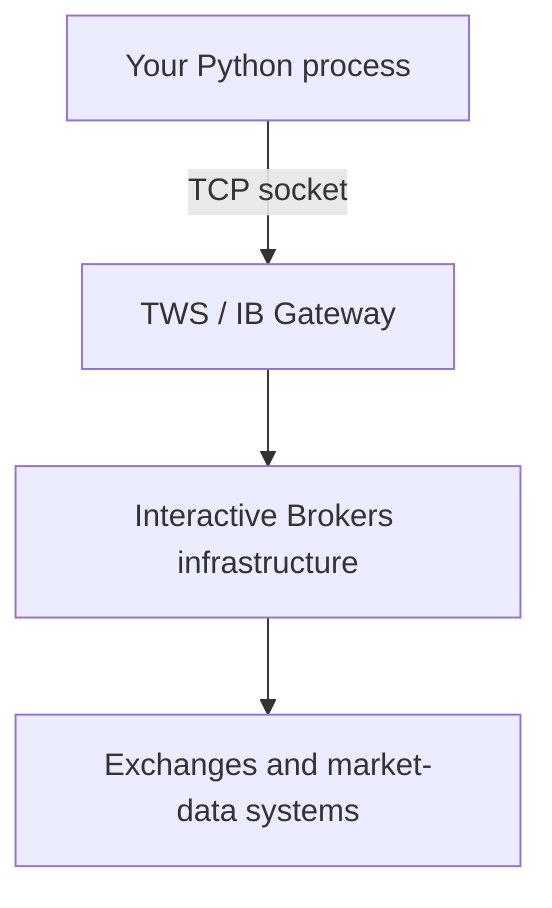
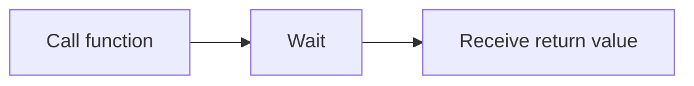
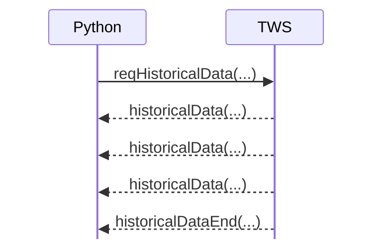
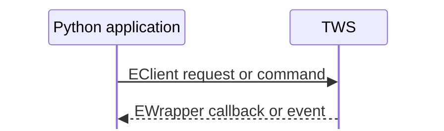
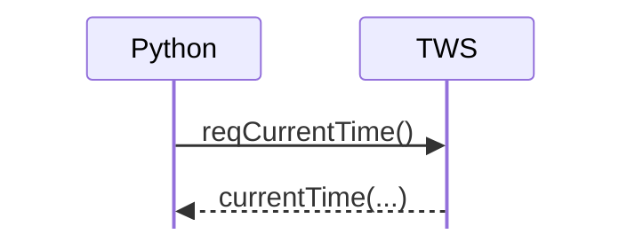
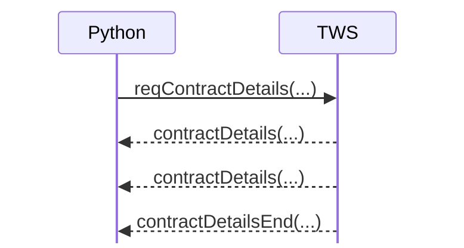
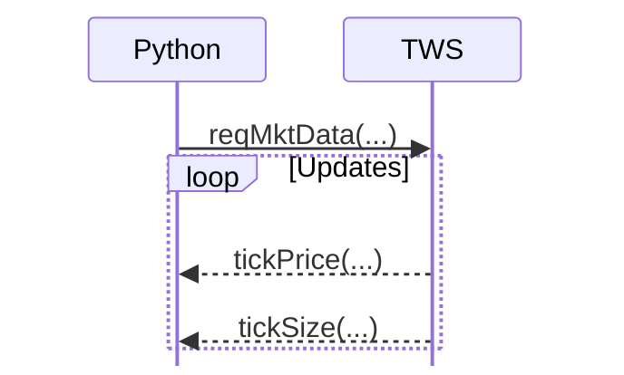
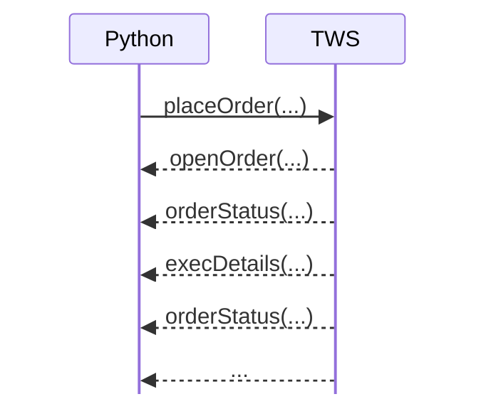
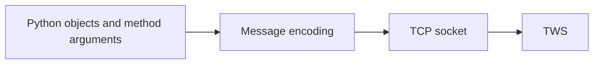
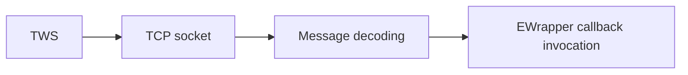

# TWS API architecture

Before learning individual API calls, it helps to understand what the TWS API actually is.

The native Python package is not a conventional library where a function call returns the requested broker data directly. Your Python process connects to a running Trader Workstation (TWS) or IB Gateway process over a TCP socket. Requests are encoded and sent to TWS, while responses and events arrive asynchronously and are dispatched back into your code through callbacks.



This distinction explains most of the API's design.

## TWS is part of the runtime architecture

Your program does not normally connect straight to an exchange or directly to IBKR's backend trading systems. Instead, it connects to TWS or IB Gateway running on a machine you control.

TWS therefore has two roles:

1. it is an interactive trading application;
2. it is an API host that your Python process can connect to.

IB Gateway plays the same API-host role with a smaller user interface.

For learning, TWS is convenient because you can inspect account state, orders, and market data visually while your Python program interacts with the same session.

## The API is message-oriented

Consider a normal synchronous Python API:

```python
bars = client.get_historical_bars("NVDA")
```

The mental model is:



The native TWS API works differently. A historical-data request is conceptually closer to this:



`reqHistoricalData()` sends a request. It does not return a collection of bars. The bars arrive later through callback methods.

This is why understanding the distinction between sending and receiving is more useful than memorizing method names.

## Two directions of communication

The Python API exposes two central classes:



`EClient` contains methods used to send requests and commands. Examples include:

- `reqCurrentTime()`
- `reqContractDetails()`
- `reqHistoricalData()`
- `reqMktData()`
- `reqPositions()`
- `placeOrder()`
- `cancelOrder()`

`EWrapper` defines callback methods through which decoded messages are delivered back to your application. Examples include:

- `currentTime()`
- `contractDetails()`
- `historicalData()`
- `tickPrice()`
- `position()`
- `openOrder()`
- `orderStatus()`
- `error()`

The next chapter examines how one Python object is commonly used to combine those two roles.

## Requests, responses, and events

Not every interaction follows exactly the same pattern. A useful taxonomy is:

### One request, one callback



### One request, many callbacks, then an end marker



### Subscription until cancelled



The stream continues until the subscription is cancelled or the connection ends.

### Command followed by lifecycle events

Orders are more stateful:



These callback patterns will recur throughout the guide.

## Why request IDs matter

Because several requests can be in flight simultaneously, many API calls include a request identifier:

```python
self.reqContractDetails(reqId=10, contract=contract)
self.reqContractDetails(reqId=11, contract=another_contract)
```

The corresponding callbacks include the same identifier, allowing your application to correlate incoming messages with the request that caused them.

The exact identifier rules differ between request IDs, order IDs, and client IDs, so those concepts deserve their own chapter later. For now, the important point is that asynchronous systems need explicit correlation between outgoing requests and incoming messages.

## What the Python package is doing for you

At a high level, the native API package handles protocol mechanics such as:



and in the other direction:



You normally work with Python methods and objects rather than manually encoding socket messages, but keeping the protocol underneath in mind makes the callback architecture much easier to reason about.

## What belongs in this learning repository

This repository stays close to the native API. We will learn how TWS behaves before considering higher-level abstractions.

That means early examples may look slightly more explicit than code in a production application. This is intentional. The goal is to see:

- when a request is sent;
- what callback receives the response;
- which object represents the data;
- how multiple messages are correlated;
- which thread is processing callbacks;
- when a request or subscription is complete.

Once those mechanics are understood, production abstractions become much easier to evaluate.

## Official references

Use the current Interactive Brokers Campus TWS API documentation as the authoritative source for API behavior and signatures. In particular, consult the introduction and connectivity sections while working through this chapter.
