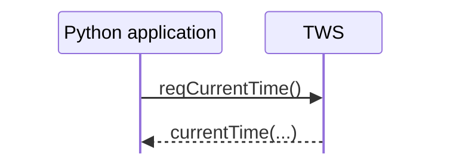
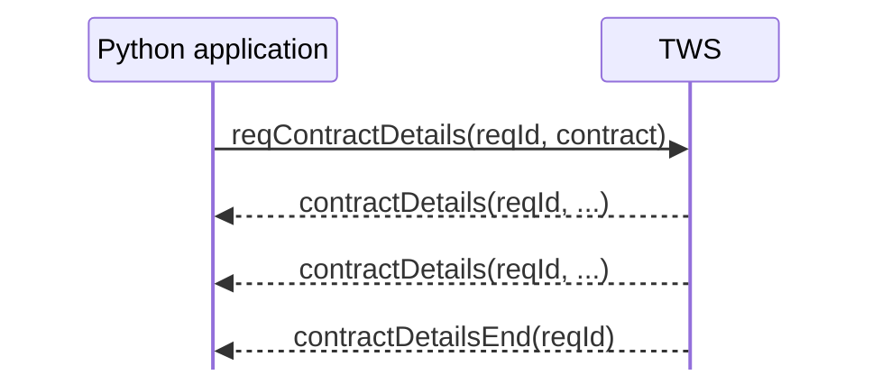
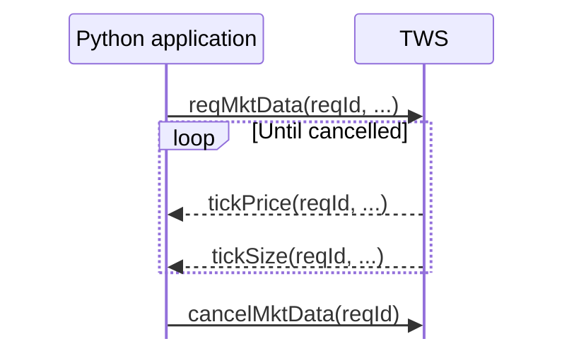
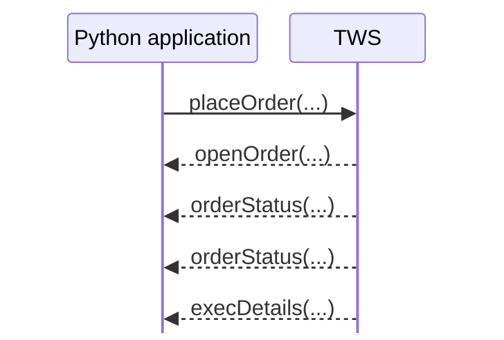

# Requests, responses, subscriptions, and callback patterns

The TWS API does not use one single request/response shape.

Some requests produce one callback. Others produce many callbacks, continue until cancelled, or trigger a sequence of later events. Recognizing these patterns makes unfamiliar parts of the API much easier to read.

## Four recurring patterns

### 1. One request, one callback

The current-time example is the simplest case:



The important point is still that `reqCurrentTime()` does not return the server time directly. The result arrives later through `currentTime(...)`.

### 2. One request, many callbacks, then an end marker

Some requests return a finite collection of results.

For example, a contract-details request can match more than one contract:



Here, `contractDetailsEnd(...)` tells the application that the finite response is complete.

This pattern appears whenever one request may produce zero, one, or many result callbacks before completion.

### 3. A subscription that continues until cancelled

Streaming market data behaves differently. A request opens a continuing flow of updates:



There is no natural "final response" while the subscription remains active. The application is responsible for cancelling it when the data is no longer needed.

### 4. A command followed by lifecycle events

Some API calls cause something to happen rather than simply asking for data.

Orders are the clearest example:



The important distinction is that these callbacks describe the evolving state of the order. They are not a single response object returned by `placeOrder()`.

We will study order semantics later; for now, recognize the interaction shape.

## Not every callback is a direct response to your latest request

TWS can also send events that are not the direct response to the line of code you most recently executed.

The startup messages seen in the first example are a simple case. Order-state changes and other broker-side events can also arrive because something changed externally.

So it is better to think in terms of a stream of API messages than a sequence of isolated function calls:

```text
outgoing request or command
        ↓
TWS processes activity
        ↓
incoming messages and events
        ↓
EWrapper callbacks
```

## Request IDs connect requests to callbacks

Many requests include a request ID, commonly named `reqId`:

```python
self.reqContractDetails(reqId, contract)
```

and the corresponding callbacks return the same ID:

```python
def contractDetails(self, reqId, contractDetails): ...
```

This lets one application have several operations active at the same time and determine which callbacks belong to which request.

We will cover request IDs, client IDs, and order IDs properly in the next chapter.

## A useful reading strategy

When you encounter a new `EClient` method in the IBKR documentation, ask four questions:

1. Which `EWrapper` callback or callbacks can follow it?
2. Is the result a single callback or a finite sequence?
3. Is there an end callback?
4. Does the operation stay active until an explicit cancellation?

Those questions usually reveal the interaction model much faster than reading the method signature alone.

## The mental model to keep

```text
single result
request → callback

finite result set
request → callback → callback → ... → end callback

subscription
request → callback → callback → ... → cancel

lifecycle
command → state/event callbacks over time
```

These patterns are not separate transport mechanisms. They all use the same connection, message queue, and callback-dispatch machinery described in the previous chapter.

The next chapter explains the identifiers used to keep concurrent requests, clients, and orders distinct.

## Official references

- [TWS API architecture](https://www.interactivebrokers.com/docs/tws-api/doc/architecture/introduction)
