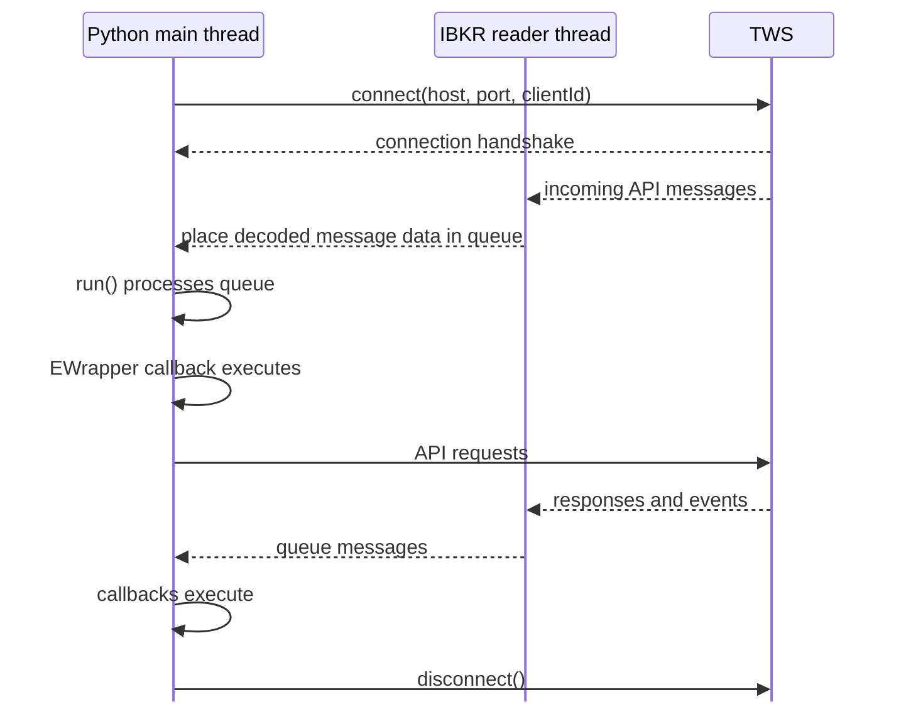
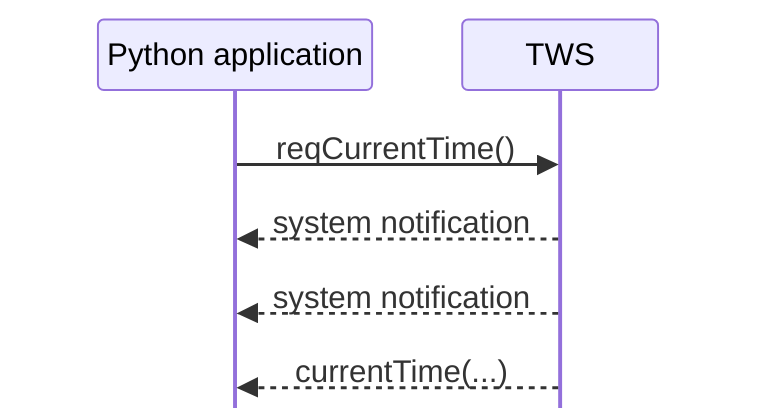

# Connection lifecycle and event loop

The first example already showed the basic sequence:

```python
app.connect(host="127.0.0.1", port=7497, clientId=1)
app.run()
```

and then, later, callbacks such as:

```python
def nextValidId(self, orderId: int) -> None:
    ...


def currentTime(self, time: int) -> None:
    ...
```

This chapter explains what is happening between those lines.

## The lifecycle at a glance

A useful mental model is:



There are two separate jobs to keep in mind:

1. **receive network messages from TWS**;
2. **process those messages and invoke your callbacks**.

In the Python API, those jobs are not performed by the same thread.

## What `connect()` does

When you call:

```python
app.connect(host="127.0.0.1", port=7497, clientId=1)
```

`EClient` first asks the operating system to open a TCP socket to TWS.

Once the socket is open, the API and TWS perform an initial handshake. Part of that handshake is agreeing on a protocol version that both sides understand. This matters because later messages must be encoded and decoded using the same protocol version.

After the connection has been established, the Python API automatically starts its internal reader thread.

That thread receives incoming socket messages and places them into a message queue.

Conceptually:

```text
TWS
 ↓ socket data
reader thread
 ↓
message queue
```

You do not create that reader thread yourself in the Python API.

## A socket connection is not the same as API readiness

It is tempting to think:

```text
connect() returned
    ↓
ready to send requests
```

but that is too early a mental model.

After the TCP connection is established, the API still completes its initial protocol handshake and receives session information from TWS.

One of the callbacks sent during this startup sequence is:

```python
def nextValidId(self, orderId: int) -> None:
    ...
```

IBKR specifically recommends `nextValidId()` as a common signal that the connection is ready for normal API requests. Requests sent before this stage may be dropped.

That is why the first example does this:

```python
def nextValidId(self, orderId: int) -> None:
    print(f"Connected. Next valid order ID: {orderId}")
    self.reqCurrentTime()
```

rather than:

```python
app.connect(...)
app.reqCurrentTime()
```

We are not interested in order IDs yet. We are using this callback as an explicit readiness point.

The meaning of the ID itself will be covered later in the identifiers chapter.

## What `run()` does

The other crucial line is:

```python
app.run()
```

In Python, the reader thread is already receiving messages from TWS and placing them in a queue.

`run()` processes that queue. For each incoming API message it eventually dispatches the corresponding `EWrapper` callback.

The flow is therefore closer to:

```text
TWS
 ↓
reader thread
 ↓
message queue
 ↓
run()
 ↓
message decoding / dispatch
 ↓
EWrapper callback
```

rather than:

```text
run() directly waits on the socket
```

This distinction becomes useful when we later introduce threading.

## Why `run()` blocks

`run()` is a processing loop. Once called, it keeps waiting for and processing queued API messages while the client remains connected.

So this code:

```python
print("before")
app.run()
print("after")
```

normally prints:

```text
before
```

and does not reach `after` until the API connection ends.

That is why our first example calls `disconnect()` after receiving the server time. Once the connection closes, the processing loop can finish and control returns to the code after `run()`.

## Which thread executes callbacks?

This depends on which thread calls `run()`.

Our current example does this on the main thread:

```python
app.run()
```

so the queue is processed on the main thread and callbacks such as:

```python
def nextValidId(...):
    ...


def currentTime(...):
    ...
```

also execute on that thread.

Meanwhile, the IBKR-created reader thread continues receiving socket messages in the background.

So the current example is roughly:

```text
main thread
├── app.run()
├── processes message queue
└── executes EWrapper callbacks

IBKR reader thread
└── receives socket messages and fills queue
```

Later applications often move `app.run()` to a separate application-managed thread so that the main thread can perform other work. We do not need that architecture yet, and introducing it here would hide the lifecycle we are trying to understand.

## Requests and callbacks can interleave

Your program does not own a private request-response channel where nothing else can happen between a request and its response.

For example, the first connection can produce output like:

```text
Connected. Next valid order ID: 1
ERROR -1 ... 2104 Market data farm connection is OK:usfarm
ERROR -1 ... 2106 HMDS data farm connection is OK:euhmds
IBKR server time: 2026-08-22T01:50:02+02:00
```

The server-time request still worked correctly. The other messages simply arrived and were processed while the application was waiting for `currentTime()`.

This is normal for an event-driven API:



A request therefore does not imply that the next callback must belong to that request.

This becomes even more important once we have several requests and subscriptions active at the same time.

## What `disconnect()` does here

Our example calls:

```python
self.disconnect()
```

inside `currentTime()`.

That ends the API connection because the example has received the one result it wanted. With the client no longer connected, `run()` can leave its processing loop and the program exits.

For long-running applications, disconnecting is usually an explicit lifecycle decision rather than something done after each response.

Later chapters will cover subscription cancellation, broken connections, and reconnect behavior separately.

## The complete first-example lifecycle

Putting the pieces together:

```text
main thread calls connect()
        ↓
TCP socket opens
        ↓
TWS/API protocol handshake
        ↓
IBKR reader thread starts
        ↓
incoming messages enter queue
        ↓
main thread calls run()
        ↓
run() processes queue
        ↓
nextValidId(...)
        ↓
reqCurrentTime()
        ↓
other messages may arrive
        ↓
currentTime(...)
        ↓
disconnect()
        ↓
run() exits
```

That is the core lifecycle behind the simple example.

## What to keep in mind

At this stage, the important ideas are:

- `connect()` establishes the socket connection and performs the initial API handshake;
- the Python API automatically runs an internal reader thread for incoming socket messages;
- the reader thread places incoming messages on a queue;
- `run()` processes that queue and dispatches `EWrapper` callbacks;
- `nextValidId()` is a useful readiness signal before sending normal requests;
- callbacks execute on whichever thread is running `run()`;
- unrelated events can arrive between a request and its response;
- `disconnect()` ends the connection and allows the processing loop to terminate.

The next chapter builds on this lifecycle by separating the different interaction patterns the API uses: single responses, finite multi-message responses, subscriptions, and ongoing lifecycle events.

## Official references

- [Establishing an API connection](https://www.interactivebrokers.com/docs/tws-api/doc/connectivity/establishing-an-api-connection)
- [Python implementation of the EReader/message queue](https://www.interactivebrokers.com/docs/tws-api/doc/connectivity/the-e-reader-thread/python-implementation)
- [Essential components of TWS API programs](https://ibkrcampus.com/campus/trading-lessons/essential-components-of-tws-api-programs/)
