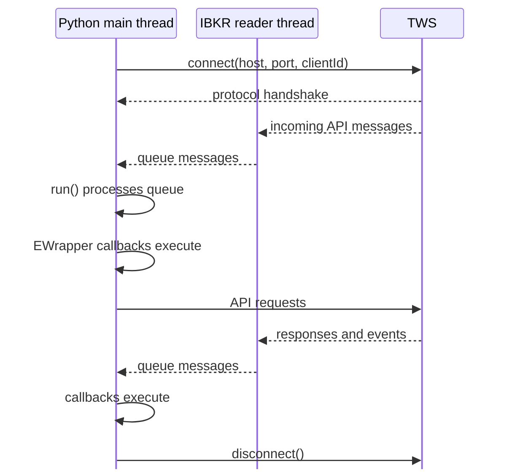
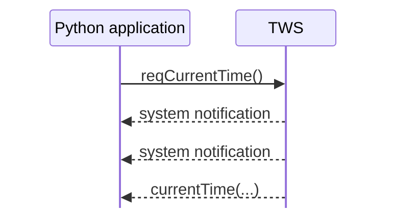

# Connection lifecycle and event loop

The first example used two lines that carry much of the TWS API lifecycle:

```python
app.connect(host="127.0.0.1", port=7497, clientId=1)
app.run()
```

`connect()` establishes the API connection. `run()` keeps processing incoming API messages so that `EWrapper` callbacks can execute.

The important detail is that these are different responsibilities.

## The lifecycle at a glance



For the Python API, think in terms of this pipeline:

```text
TWS
 ↓ socket data
reader thread
 ↓
message queue
 ↓
run()
 ↓
EWrapper callback
```

## What `connect()` establishes

When you call:

```python
app.connect(host="127.0.0.1", port=7497, clientId=1)
```

`EClient` asks the operating system to open a TCP socket to TWS. Once the socket is open, TWS and the API perform an initial handshake and agree on a protocol version they both understand.

After the connection is established, the Python API automatically starts its internal reader thread. The reader thread runs inside your Python process and receives incoming socket messages, placing them into a queue.

You do not create the reader thread yourself.

## Connection is not yet readiness

A successful socket connection does not mean the application should immediately start sending normal API requests.

During startup, TWS sends session information to the client. One of the callbacks is:

```python
def nextValidId(self, orderId: int) -> None: ...
```

IBKR documents `nextValidId()` as a common signal that connection setup has completed far enough for API requests to be sent. Calls made before this point may be dropped.

That is why our first example requests the server time from inside `nextValidId()`:

```python
def nextValidId(self, orderId: int) -> None:
    self.reqCurrentTime()
```

The order ID itself is not important yet; we will cover IDs separately.

## What `run()` does

The reader thread receives messages, but it does not execute your callbacks directly.

`run()` processes the message queue and dispatches the corresponding `EWrapper` methods.

So:

```python
app.run()
```

means, conceptually:

> Keep processing incoming API messages and invoking their callbacks while this client remains connected.

This is why `run()` blocks. Code after it normally does not execute until the connection ends.

```python
print("before")
app.run()
print("after")
```

will normally print `before`, process API messages for as long as the connection remains active, and only later reach `after`.

## Which thread executes callbacks?

Callbacks execute on the thread that runs `run()`.

Our current example calls:

```python
app.run()
```

on the main thread. Therefore `nextValidId()`, `currentTime()`, and other dispatched callbacks also execute on the main thread.

Meanwhile, the IBKR-created reader thread receives socket messages in the background:

```text
main thread
├── run()
├── processes message queue
└── executes EWrapper callbacks

IBKR reader thread
└── receives socket messages and fills queue
```

Later applications may put `run()` on another application-managed thread so the main thread can do other work. We do not need that structure yet.

## Messages can interleave

A request does not reserve the connection until its response arrives.

In the first example we sent:

```python
self.reqCurrentTime()
```

but TWS could deliver system notifications before `currentTime()` arrived.



Nothing has gone wrong. The event loop simply processes messages as they arrive.

This becomes increasingly important once several requests and subscriptions are active at the same time.

## Disconnecting

Our first example calls:

```python
self.disconnect()
```

when `currentTime()` arrives. Once the client is disconnected, `run()` can leave its processing loop and the program exits.

Long-running applications will usually remain connected and keep processing messages instead. Connection failures and reconnect behavior belong to the later robustness section.

## The mental model to keep

```text
connect()
   ↓
TCP connection + protocol handshake
   ↓
reader thread receives messages
   ↓
messages enter queue
   ↓
run() processes queue
   ↓
EWrapper callbacks execute
   ↓
disconnect()
   ↓
run() exits
```

The key ideas are:

- `connect()` establishes the socket connection and performs the initial API handshake;
- the Python API automatically creates a reader thread for incoming socket messages;
- the reader thread places messages on a queue;
- `run()` processes that queue and dispatches callbacks;
- `nextValidId()` is a useful readiness signal before normal requests are sent;
- callbacks execute on whichever thread is running `run()`;
- unrelated events may arrive between a request and its response.

The next chapter builds on this by separating the different request and callback patterns used throughout the API.

## Official references

- [Establishing an API connection](https://www.interactivebrokers.com/docs/tws-api/doc/connectivity/establishing-an-api-connection)
- [Python implementation of the EReader/message queue](https://www.interactivebrokers.com/docs/tws-api/doc/connectivity/the-e-reader-thread/python-implementation)
- [Essential components of TWS API programs](https://ibkrcampus.com/campus/trading-lessons/essential-components-of-tws-api-programs/)
