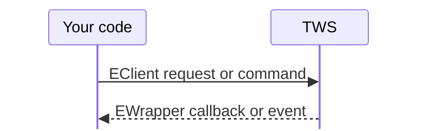
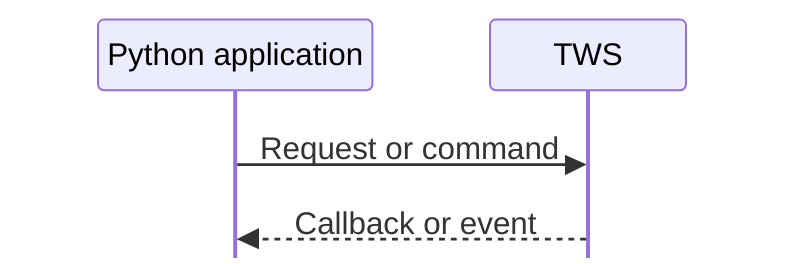
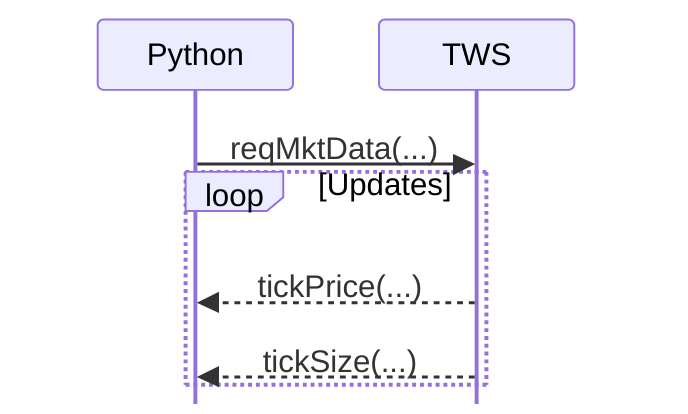

# `EClient` and `EWrapper`

The `EClient`/`EWrapper` split is the central design pattern of the native TWS API.

If this relationship is unclear, much of the API can feel arbitrary. Once it is understood, the rest of the interface becomes much more predictable.

## Two responsibilities

`EClient` represents the **outbound** side of the connection.

You call methods on it when you want to ask TWS to do something:

```python
self.reqCurrentTime()
self.reqPositions()
self.reqHistoricalData(...)
self.placeOrder(...)
```

`EWrapper` represents the **inbound** side.

It defines callback methods that the API invokes when TWS sends information back:

```python
def currentTime(self, time: int) -> None:
    ...

def position(self, account, contract, position, avgCost) -> None:
    ...

def historicalData(self, reqId, bar) -> None:
    ...
```

A useful mental model is:



## Why do we override inherited methods?

`EWrapper` is a base class containing callback method definitions.

The API's message-processing machinery knows the callback names that correspond to incoming protocol messages. When a "current time" message is decoded, for example, the wrapper's `currentTime()` method is called.

If your subclass does nothing, the inherited implementation has no application-specific behavior to perform.

By overriding the method:

```python
class TradingApp(EWrapper, EClient):
    def currentTime(self, time: int) -> None:
        print(time)
```

you are saying:

> When the API dispatches a current-time message to this wrapper object, run this implementation.

The callback method name and signature are therefore part of the API contract. They are not arbitrary names chosen by the application.

## Why combine both classes?

A common native Python pattern is:

```python
from ibapi.client import EClient
from ibapi.wrapper import EWrapper


class TradingApp(EWrapper, EClient):
    def __init__(self) -> None:
        EClient.__init__(self, wrapper=self)
```

This object has two roles:

1. because it inherits from `EClient`, it can send requests;
2. because it inherits from `EWrapper`, it can receive callbacks.

The important line is:

```python
EClient.__init__(self, wrapper=self)
```

The `EClient` needs a wrapper object to which incoming decoded messages can be dispatched. Here, the same `TradingApp` instance is supplied as that wrapper.

Conceptually:

```text
TradingApp instance
│
├── EClient behavior
│     └── sends requests to TWS
│
└── EWrapper behavior
      └── receives decoded callbacks from TWS
```

The fact that both responsibilities live on one object is a convenience, not a fundamental requirement of networking itself. For learning the native API, however, it keeps the request/callback relationship visible.

## A complete minimal interaction

Suppose the application sends:

```python
self.reqCurrentTime()
```

The interaction is approximately:

```text
1. Your code calls reqCurrentTime()
2. EClient encodes a protocol request
3. The request is written to the TWS socket
4. TWS handles the request
5. A response arrives over the socket
6. The Python API decodes the response
7. The wrapper's currentTime(...) callback is invoked
8. Your overridden currentTime(...) method runs
```

Notice what is *not* happening:

```python
current_time = self.reqCurrentTime()  # not how the API works
```

The useful result arrives through the callback later.

## Multiple inheritance is not the important concept

It is easy to focus too much on this syntax:

```python
class TradingApp(EWrapper, EClient):
```

The more important concept is the division of responsibilities.

Even if a future application wrapped these classes behind separate components, the underlying API would still behave as:



We therefore use the conventional combined class in early examples, not because it is the only possible architecture, but because it exposes the native API model directly.

## Why callbacks are useful

Callbacks are a natural fit for data that may arrive:

- later;
- multiple times;
- continuously;
- because of an external event rather than a direct request.

A market-data subscription is the clearest example. After subscribing, the application may receive updates for minutes or hours:



There is no sensible single return value from `reqMktData()` that could represent all future ticks.

The same event-driven model also fits order state. An order can move through multiple states and receive partial fills without the application continuously issuing new requests.

## Keep callback methods small while learning

Early examples in this repository keep callback implementations deliberately simple:

```python
def currentTime(self, time: int) -> None:
    print(f"Server time: {time}")
```

That makes it clear *when* the callback runs.

Later examples may collect results into a list or maintain state, but we will avoid hiding callbacks behind a large application framework. This is a training repository, so visibility of the mechanics is more important than production abstraction.

## Common source of confusion: calling versus being called

This distinction is worth making explicit.

You call `EClient` methods:

```python
app.reqPositions()
```

The API calls your `EWrapper` overrides:

```python
def position(...):
    ...
```

So when reading example code, ask:

> Is this a method my application invokes, or a method the API invokes?

That question resolves a surprising amount of confusion in TWS API code.

## Next step

The next example connects to TWS, starts the API processing loop, requests the current server time, handles the callback, and disconnects. It is intentionally small so that the full lifecycle can be traced end to end.
