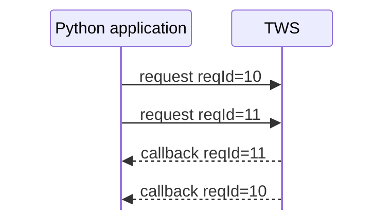

# Request IDs, order IDs, and client IDs

The TWS API uses several different identifiers, and they solve different problems.

The three most important at this stage are:

```text
clientId  -> which API connection?
reqId     -> which request?
orderId   -> which API order?
```

Keeping those roles separate prevents a lot of confusion later.

## `clientId`: identify an API connection

When connecting to TWS, the application supplies a client ID:

```python
app.connect(host="127.0.0.1", port=7497, clientId=1)
```

The `clientId` identifies that API connection to the TWS session.

If several API programs connect to the same TWS instance at the same time, each connection needs its own client ID. Reusing an ID that is already connected causes the connection to be rejected.

Conceptually:

```text
TWS
├── clientId 1 -> application A
├── clientId 2 -> application B
└── clientId 3 -> application C
```

The client ID also becomes important for order ownership and visibility. We will return to those details in the orders section.

## `reqId`: correlate a request with its callbacks

Many `EClient` methods ask the application to provide a request ID, usually named `reqId`.

For example:

```python
self.reqContractDetails(reqId, contract)
```

The corresponding callbacks return the same ID:

```python
def contractDetails(self, reqId, contractDetails): ...


def contractDetailsEnd(self, reqId): ...
```

That lets the application determine which callbacks belong to which request.



The callbacks do not have to arrive in the same order as the requests were sent. The ID provides the correlation.

In practice, your application should use distinct request IDs for requests that may be active at the same time.

## `orderId`: identify an API order

Orders use a different identifier: `orderId`.

A basic order submission has the shape:

```python
self.placeOrder(orderId, contract, order)
```

and order-related callbacks include that order ID so the application can associate later state changes with the order.

Unlike an ordinary `reqId`, you should not simply restart order numbering from an arbitrary value whenever the program starts.

TWS provides a valid starting point through:

```python
def nextValidId(self, orderId: int) -> None: ...
```

which you already saw during connection startup.

For a simple single-client application, the normal pattern is:

```text
nextValidId() -> receive starting order ID
        ↓
use that ID for the next new order
        ↓
increment for each subsequent new order
```

The exact multi-client order-ID rules matter when we begin placing and managing orders, so they belong in the orders section rather than here.

## These IDs are not interchangeable

It is useful to compare them directly:

| Identifier | Identifies | Supplied by | Common purpose |
| --- | --- | --- | --- |
| `clientId` | API connection | application at `connect()` | distinguish simultaneous API clients |
| `reqId` | request/subscription | application | correlate callbacks with a request |
| `orderId` | API order | application, using the valid sequence supplied by TWS | track order state and later order actions |

So this would be conceptually wrong:

```text
"ID 12" means one universal thing inside IBKR
```

The meaning depends on the identifier type and the API operation using it.

## What about `conId`?

`conId` is another important IBKR identifier, but it identifies a **financial instrument**, not a connection, request, or order.

We will introduce it properly in the contracts section.

## A useful reading habit

Whenever an unfamiliar TWS API method contains an integer ID, ask:

1. What does this ID identify?
2. Who chooses or assigns it?
3. Which callbacks return it?
4. How long does it need to remain unique?

That is usually more useful than treating every parameter ending in `Id` as the same kind of value.

## The mental model to keep

```text
clientId
└── identifies the API connection

reqId
└── identifies a request or subscription

orderId
└── identifies an API order

conId
└── identifies an instrument (covered later)
```

The next chapter moves from identifiers to the main objects passed through these requests and callbacks.

## Official references

- [TWS API architecture](https://www.interactivebrokers.com/docs/tws-api/doc/architecture/introduction)
- [Verify API connection](https://www.interactivebrokers.com/docs/tws-api/doc/connectivity/verify-api-connection)
- [Receive next valid ID](https://www.interactivebrokers.com/docs/tws-api/doc/next-valid-id/receive-next-valid-id)
- [Request next valid ID](https://www.interactivebrokers.com/docs/tws-api/doc/next-valid-id/request-next-valid-id)
