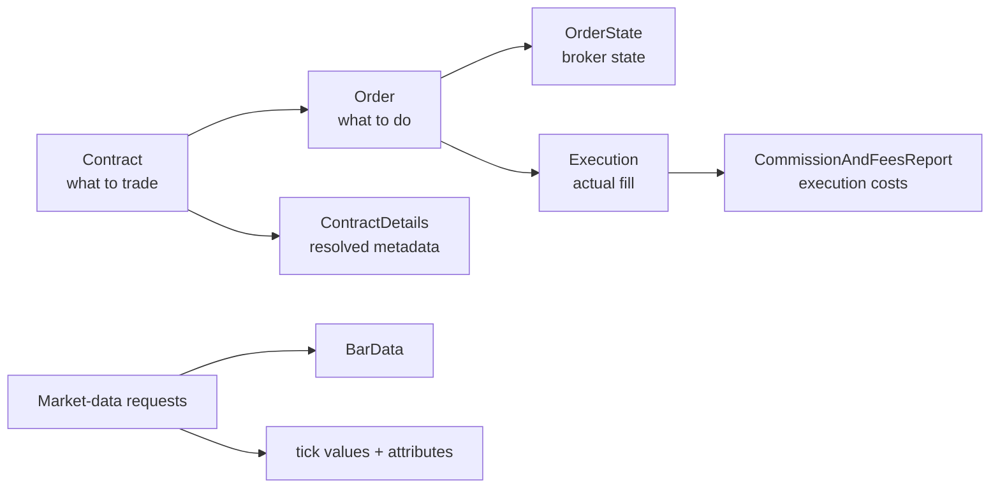

# Core IBKR object model

The TWS API does not exchange only primitive values such as strings, numbers, and IDs. Many requests and callbacks use structured Python objects that represent broker-domain concepts.

You do not need to memorize every field yet. The important first step is to recognize **what kind of thing each object represents** and how the main objects relate to one another.

## The main object families

For stock trading, the recurring objects can be grouped roughly like this:

| Object | Represents |
| --- | --- |
| `Contract` | The financial instrument |
| `ContractDetails` | IBKR's resolved metadata for that instrument |
| `Order` | Instructions for what you want IBKR to do |
| `OrderState` | IBKR's current state/details for an order |
| `Execution` | An actual fill |
| `CommissionAndFeesReport` | Costs associated with an execution |
| `BarData` | One historical or real-time OHLC bar |
| `TickAttrib` and related tick objects | Attributes attached to tick data |

The exact fields belong in the later topic-specific chapters. For now, focus on the roles.

## `Contract`: what instrument are we talking about?

A `Contract` describes the financial instrument involved in a request or order.

For a U.S. stock, it will eventually contain information such as:

```text
symbol
security type
currency
exchange
primary exchange
conId
```

The application often constructs a `Contract` and sends it to TWS:

```text
Python application
      │
      │ Contract
      ▼
     TWS
```

We will spend the entire next section learning how stock contracts are defined and resolved correctly.

## `ContractDetails`: what does IBKR know about it?

`ContractDetails` is richer metadata returned by IBKR after contract resolution.

Conceptually:

```text
Contract
   │
   │ reqContractDetails(...)
   ▼
TWS / IBKR contract database
   │
   ▼
ContractDetails
```

A useful distinction is:

```text
Contract        -> identifies/describes an instrument
ContractDetails -> metadata IBKR returns about a resolved instrument
```

## `Order` and `OrderState`: instruction versus broker state

An `Order` describes what you want IBKR to do.

Examples of fields include the action, quantity, order type, limit price, and time in force.

An `OrderState`, by contrast, contains state information produced by IBKR for an order.

So the mental model is:

```text
Order      -> your instruction
OrderState -> IBKR's state/details for that order
```

An order also needs a `Contract`, because IBKR must know both **what to trade** and **what action to perform**:

```text
Contract + Order
       │
       ▼
  placeOrder(...)
```

We will examine both objects properly in the orders section.

## `Execution`: what actually filled?

An order is not the same thing as a trade.

When some or all of an order is filled, IBKR represents the fill with an `Execution` object. It contains information such as execution price, filled quantity, execution time, exchange, and execution ID.

This gives us an important separation:

```text
Order
  │
  │ may produce
  ▼
Execution
```

One order can produce more than one execution, for example when it is partially filled.

IBKR can also report the commissions and fees associated with an execution through `CommissionAndFeesReport`.

```text
Order
  │
  ├── Execution 1 ── CommissionAndFeesReport
  └── Execution 2 ── CommissionAndFeesReport
```

The execution and commission chapters will cover those relationships in detail.

## Market-data objects

Market-data callbacks also use small structured objects.

Historical and real-time bar callbacks can provide `BarData`, representing one OHLC bar with fields such as:

```text
time
open
high
low
close
volume
```

Tick callbacks may include objects such as `TickAttrib`, `TickAttribBidAsk`, or `TickAttribLast` alongside prices and sizes. These objects carry attributes describing the tick rather than replacing the price or size itself.

We will introduce them when we reach the corresponding market-data APIs.

## Objects you create versus objects IBKR returns

A useful first approximation is:

```text
Commonly created by your application
├── Contract
└── Order

Commonly returned by IBKR
├── ContractDetails
├── OrderState
├── Execution
├── CommissionAndFeesReport
├── BarData
└── tick attribute objects
```

This is not a strict ownership rule. For example, callbacks can return `Contract` and `Order` objects as part of broker state. The distinction is simply useful for understanding the normal direction of a workflow.

## Objects and IDs solve different problems

The previous chapter introduced identifiers such as `reqId`, `orderId`, and `clientId`.

Those identifiers correlate activity. The objects carry the actual domain data.

For example:

```text
reqId
  └── tells you which request a callback belongs to

ContractDetails
  └── contains the returned contract metadata
```

and:

```text
orderId
  └── identifies the API order workflow

Order / OrderState / Execution
  └── carry information about that workflow
```

Do not treat the ID and the object as interchangeable concepts.

## The mental model to keep



The important distinction is not the individual fields yet. It is the role of each object:

```text
Contract        -> instrument
ContractDetails -> resolved instrument metadata
Order           -> instruction
OrderState      -> broker-side order state/details
Execution       -> fill
CommissionAndFeesReport -> fill costs
BarData / tick objects   -> market data
```

With that map in place, the next section can focus on the first object we actually need to use: `Contract`.

## Official references

- [TWS API reference](https://www.interactivebrokers.com/docs/tws-api/ref/introduction)
