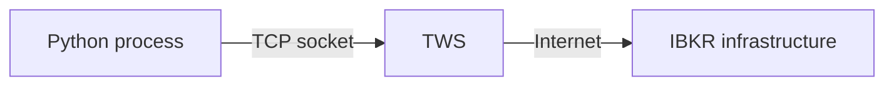

# Configure TWS for API access

The examples in this guide connect to a running Trader Workstation (TWS) process over a local TCP socket.

For learning, use a **paper-trading** TWS session.

## TWS must be running

The Python API is not a cloud REST endpoint. Your Python process connects to TWS (or IB Gateway) running on a machine you control.



## Enable API socket clients

In TWS, open the API settings and enable socket/API client connections. The exact menu wording can vary between TWS versions, so use the current IBKR documentation if the UI differs from screenshots or older tutorials.

For the examples, verify at least:

- socket clients are enabled;
- you know the configured socket port;
- the TWS session is the paper-trading session you intend to use;
- localhost connections are permitted.

## Ports

The examples initially use:

```python
host = "127.0.0.1"
port = 7497
client_id = 1
```

`7497` is commonly associated with TWS paper trading, but the configured value in your own TWS instance is authoritative.

Do not memorize a port number as part of the API model. Treat host, port, and client ID as connection configuration.

## Read-only mode

TWS can be configured to restrict API clients from submitting orders. That can be useful during the early read-only parts of the guide. Later order chapters will explicitly require paper trading and will explain the relevant setting before placing any order.

## What this page does not cover yet

Connection lifecycle, `clientId`, API readiness, reconnect behavior, and the event loop are concepts in their own right. This page only establishes the TWS-side prerequisites needed to run examples.
