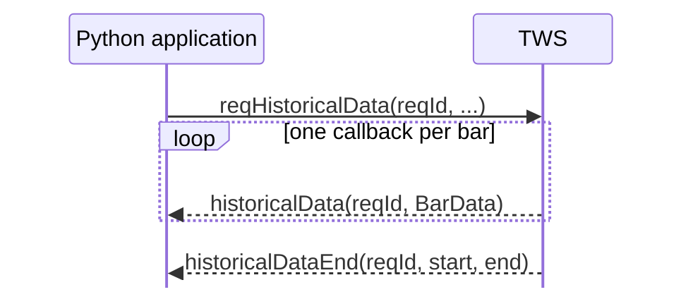

# Historical bars

Historical bars are requested with `EClient.reqHistoricalData()` and returned one bar at a time through `EWrapper.historicalData()`.

The runnable example is:

```text
examples/03_market_data/historical_bars.py
```

It requests one month of daily NVDA bars.

## The request

```python
self.reqHistoricalData(
    reqId=REQUEST_ID,
    contract=create_stock_contract(),
    endDateTime="",
    durationStr="1 M",
    barSizeSetting="1 day",
    whatToShow="TRADES",
    useRTH=1,
    formatDate=1,
    keepUpToDate=False,
    chartOptions=[],
)
```

| Parameter | Example | Meaning |
| --- | --- | --- |
| `reqId` | `1` | Correlates callbacks with this request |
| `contract` | NVDA | Instrument to query |
| `endDateTime` | `""` | End at the current time |
| `durationStr` | `"1 M"` | Look back one month |
| `barSizeSetting` | `"1 day"` | Return one-day bars |
| `whatToShow` | `"TRADES"` | Build bars from traded prices |
| `useRTH` | `1` | Regular trading hours only |
| `formatDate` | `1` | Standard date representation |
| `keepUpToDate` | `False` | Finite request, not a subscription |
| `chartOptions` | `[]` | Internal options; leave empty |

The most important new idea is that **duration and bar size describe different dimensions of the request**:

```text
durationStr    -> total historical window
barSizeSetting -> size of each bar inside that window
```

So:

```python
durationStr="1 M"
barSizeSetting="1 day"
```

means roughly one month of history divided into daily bars.

IBKR accepts duration units for seconds (`S`), days (`D`), weeks (`W`), months (`M`), and years (`Y`). Bar sizes range from seconds through months. Not every duration/bar-size combination is practical or allowed; the limits matter mainly once we start requesting small intraday bars.

## What does a bar represent?

`whatToShow` chooses the underlying data used to build the bars.

The example uses:

```python
whatToShow="TRADES"
```

so open, high, low, and close are based on traded prices.

For stocks, another important value is:

```text
ADJUSTED_LAST
```

which IBKR documents as adjusted for splits and dividends. Other values include `MIDPOINT`, `BID`, and `ASK`.

`whatToShow` therefore changes the meaning of the returned series, not just its formatting.

`useRTH=1` restricts the request to regular trading hours. `useRTH=0` allows data outside regular trading hours where available.

## The response

IBKR calls `historicalData()` once for each returned bar:

```python
from ibapi.common import BarData


def historicalData(self, reqId: int, bar: BarData) -> None:
    print(
        f"{reqId}  {bar.date}  "
        f"O={bar.open} H={bar.high} L={bar.low} C={bar.close} V={bar.volume}"
    )
```

`BarData` contains fields including `date`, `open`, `high`, `low`, `close`, `volume`, `wap`, and `barCount`.

When the finite response is complete, IBKR calls:

```python
def historicalDataEnd(self, reqId: int, start: str, end: str) -> None:
    print(f"Historical request {reqId} complete: {start} -> {end}")
    self.disconnect()
```



This is the same finite multi-callback pattern used for contract resolution, now carrying market data.

## Run it

Start TWS in paper trading and run:

```powershell
uv run python examples/03_market_data/historical_bars.py
```

The result should be a sequence of daily OHLCV bars followed by the completion message.

Market-data entitlements are covered separately in the permissions chapter.

## Official references

- [Requesting historical bars](https://www.interactivebrokers.com/docs/tws-api/doc/market-data-historical/historical-bars/requesting-historical-bars)
- [Receiving historical bars](https://www.interactivebrokers.com/docs/tws-api/doc/market-data-historical/historical-bars/receiving-historical-bars)
- [Duration](https://www.interactivebrokers.com/docs/tws-api/doc/market-data-historical/historical-bars/duration)
- [Historical bar sizes](https://www.interactivebrokers.com/docs/tws-api/doc/market-data-historical/historical-bars/historical-bar-sizes)
- [`ADJUSTED_LAST`](https://www.interactivebrokers.com/docs/tws-api/doc/market-data-historical/historical-bar-what-to-show/adjusted-last)
