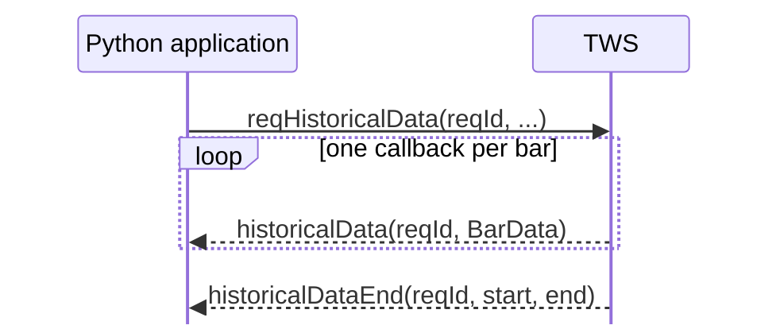

# Historical bars

Historical bars are requested with `EClient.reqHistoricalData()` and returned one bar at a time through `EWrapper.historicalData()`.

The runnable example is:

```text
examples/03_market_data/historical_bars.py
```

It requests one month of daily NVDA bars.

## The request

The core call is:

```python
self.reqHistoricalData(
    reqId=REQUEST_ID,
    contract=create_stock_contract(),
    endDateTime="",
    durationStr="1 M",
    barSizeSetting="1 day",
    whatToShow="TRADES",
    useRTH=1,
    formatDate=1,
    keepUpToDate=False,
    chartOptions=[],
)
```

The parameters describe **which instrument, which time range, and what kind of bars IBKR should return**.

| Parameter | Value in the example | Meaning |
| --- | --- | --- |
| `reqId` | `1` | Correlates callbacks with this request |
| `contract` | NVDA stock contract | Instrument to query |
| `endDateTime` | `""` | End at the current time |
| `durationStr` | `"1 M"` | Look back one month |
| `barSizeSetting` | `"1 day"` | Aggregate data into daily bars |
| `whatToShow` | `"TRADES"` | Build bars from traded prices |
| `useRTH` | `1` | Use regular trading hours only |
| `formatDate` | `1` | Return the normal date representation |
| `keepUpToDate` | `False` | One finite historical request |
| `chartOptions` | `[]` | Internal options; leave empty |

## Duration and bar size are separate

These two parameters are easy to confuse:

```text
durationStr    -> how far back to request
barSizeSetting -> size of each returned bar
```

For example:

```python
durationStr="1 M"
barSizeSetting="1 day"
```

means approximately one month of data, divided into one-day bars.

Valid duration units include seconds (`S`), days (`D`), weeks (`W`), months (`M`), and years (`Y`). Valid bar sizes range from seconds through months; the exact accepted strings are documented by IBKR.

The two values cannot be chosen independently without limit. IBKR restricts how much data can be returned for a given bar size, which becomes especially important for small intraday bars. We will deal with those limits when we start requesting intraday data.

## `endDateTime`

An empty string means:

```python
endDateTime=""
```

> end the request at the current time.

You can also provide a specific end date/time. That becomes useful for reproducible historical windows, but the first example keeps the request relative to now.

## `whatToShow`

Historical bars are not always built from the same underlying data.

The example uses:

```python
whatToShow="TRADES"
```

so the returned OHLC values describe traded prices.

Another stock-relevant choice is:

```text
ADJUSTED_LAST
```

which IBKR documents as adjusted for splits and dividends. Other values such as `MIDPOINT`, `BID`, and `ASK` produce different kinds of historical series.

So `whatToShow` is not a cosmetic option: it changes what the bar represents.

## Regular versus extended hours

```python
useRTH=1
```

requests data from regular trading hours only.

Using:

```python
useRTH=0
```

allows data outside regular trading hours where available.

For daily stock examples in this course we start with regular-session bars so the result is easy to interpret.

## The callbacks

The request produces repeated `historicalData()` callbacks:

```python
from ibapi.common import BarData


def historicalData(self, reqId: int, bar: BarData) -> None:
    print(
        f"{reqId}  {bar.date}  "
        f"O={bar.open} H={bar.high} L={bar.low} C={bar.close} V={bar.volume}"
    )
```

Each `BarData` object contains fields such as:

```text
date
open
high
low
close
volume
wap
barCount
```

For this example we print only OHLCV.

When all bars have been delivered, IBKR calls:

```python
def historicalDataEnd(self, reqId: int, start: str, end: str) -> None:
    print(f"Historical request {reqId} complete: {start} -> {end}")
    self.disconnect()
```

So the response shape is:



This is the same finite multi-callback pattern introduced earlier with contract resolution, now carrying actual market data.

## Run the example

Start TWS in paper trading and run:

```powershell
uv run python examples/03_market_data/historical_bars.py
```

A successful result will contain a sequence of daily bars followed by the completion message. Exact dates and prices depend on when you run it.

If IBKR rejects the request because of market-data entitlements, the later market-data permissions chapter explains that separately.

## What to change first

Once the example works, the most useful experiments are to change one request parameter at a time:

```python
durationStr="2 W"
barSizeSetting="1 hour"
whatToShow="ADJUSTED_LAST"
useRTH=0
```

The point is to observe how each parameter changes the returned data rather than hiding `reqHistoricalData()` behind a helper abstraction.

## Official references

- [Requesting historical bars](https://www.interactivebrokers.com/docs/tws-api/doc/market-data-historical/historical-bars/requesting-historical-bars)
- [Receiving historical bars](https://www.interactivebrokers.com/docs/tws-api/doc/market-data-historical/historical-bars/receiving-historical-bars)
- [Duration](https://www.interactivebrokers.com/docs/tws-api/doc/market-data-historical/historical-bars/duration)
- [Historical bar sizes](https://www.interactivebrokers.com/docs/tws-api/doc/market-data-historical/historical-bars/historical-bar-sizes)
- [Historical data types](https://www.interactivebrokers.com/docs/tws-api/doc/market-data-historical/historical-bar-what-to-show/adjusted-last)
